# Run Hadoop program locally with Intellij and Maven 

You may use this method to write and test your Hadoop program locally without configuring Hadoop environment on your own machine or using the clusters. This tutorial is based on [Hadoop: Intellij结合Maven本地运行和调试MapReduce程序 (无需搭载Hadoop和HDFS环境)
](https://www.polarxiong.com/archives/Hadoop-Intellij%E7%BB%93%E5%90%88Maven%E6%9C%AC%E5%9C%B0%E8%BF%90%E8%A1%8C%E5%92%8C%E8%B0%83%E8%AF%95MapReduce%E7%A8%8B%E5%BA%8F-%E6%97%A0%E9%9C%80%E6%90%AD%E8%BD%BDHadoop%E5%92%8CHDFS%E7%8E%AF%E5%A2%83.html), [How-to: Create an IntelliJ IDEA Project for Apache Hadoop](https://blog.cloudera.com/blog/2014/06/how-to-create-an-intellij-idea-project-for-apache-hadoop/) and [Developing Hadoop Mapreduce Application within Intellij IDEA on Windows 10](https://bigdataproblog.wordpress.com/2016/05/20/developing-hadoop-mapreduce-application-within-intellij-idea-on-windows-10/).

## Requirements
- [IntelliJ IDEA](https://www.jetbrains.com/idea/download)
- JDK
- Linux or Mac OS

## How to

### Create a new project
In Intellij, `Create New Project`, select `Maven` in the pop-up window, select your JDK, then `Next`. 
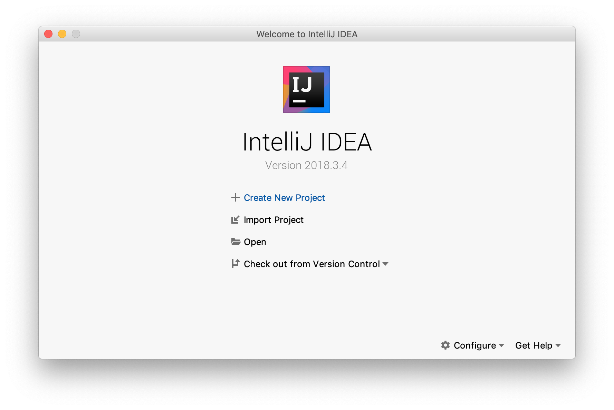
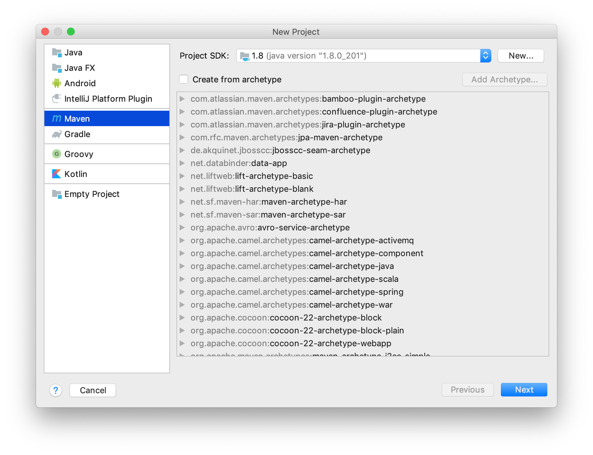

Fill your `GroupId` and `ArtifactId`, then `Next`.
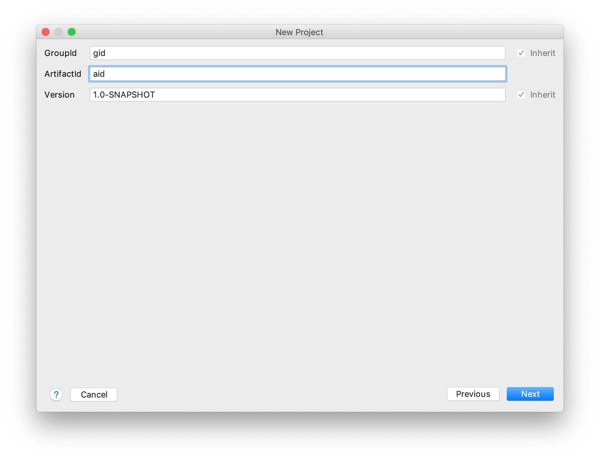

Set your `Project name` and `Project location`, then `Finish`.
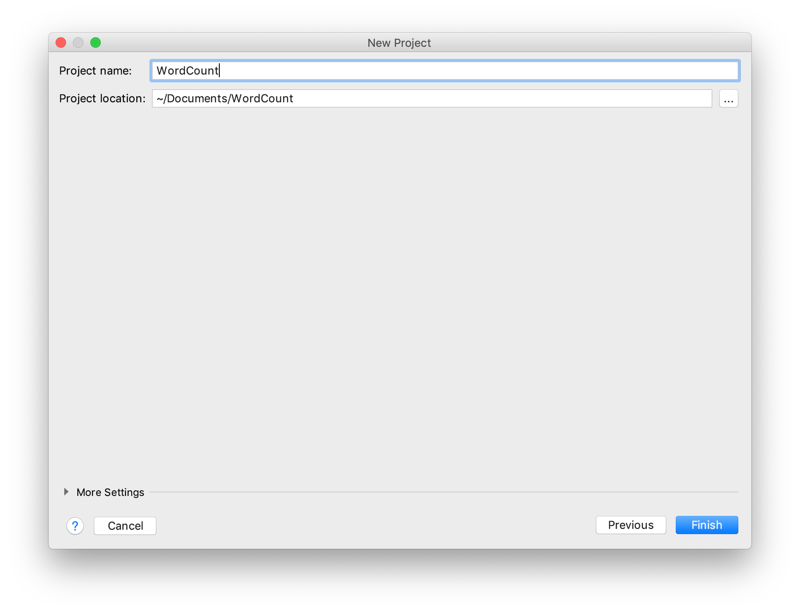

### Configure dependencies
The `pom.xml` should be open automatically, if not, find it in the Project browser. It is recommended to click `Enable Auto-Import` option in the popup dialog in the lower right corner, but you can still manually `Import Changes` any time when you modify `pom.xml`.
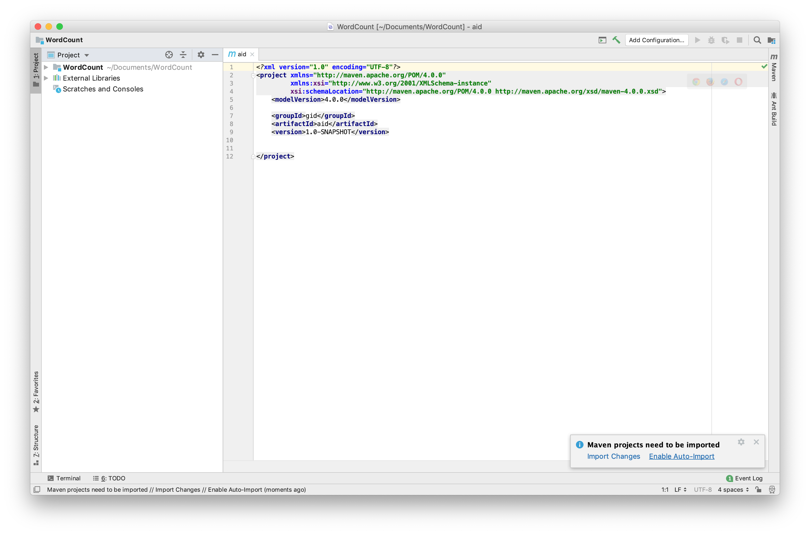

Paste the following 2 blocks before the last `</project>` tag.

```xml
<repositories>
    <repository>
        <id>apache</id>
        <url>http://maven.apache.org</url>
    </repository>
</repositories>
```

```xml
<dependencies>
    <dependency>
        <groupId>org.apache.hadoop</groupId>
        <artifactId>hadoop-core</artifactId>
        <version>1.2.1</version>
    </dependency>
    <dependency>
        <groupId>org.apache.hadoop</groupId>
        <artifactId>hadoop-common</artifactId>
        <version>3.3.0</version>
    </dependency>
</dependencies>
```

The final `pom.xml` will look like below:
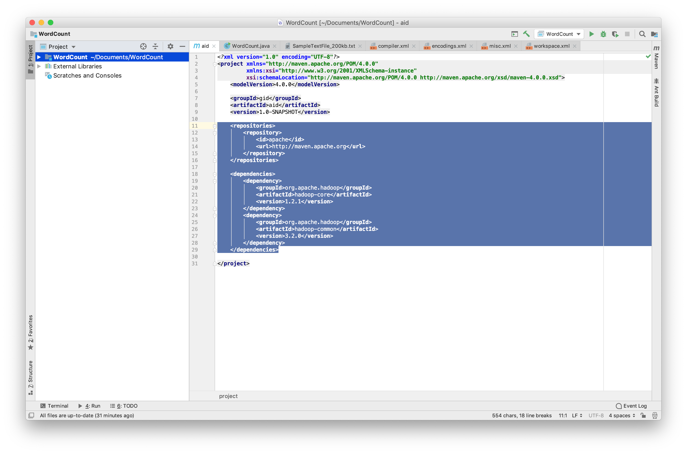

The full `pom.xml` is below:
```xml
<?xml version="1.0" encoding="UTF-8"?>
<project xmlns="http://maven.apache.org/POM/4.0.0"
         xmlns:xsi="http://www.w3.org/2001/XMLSchema-instance"
        xsi:schemaLocation="http://maven.apache.org/POM/4.0.0 http://maven.apache.org/xsd/maven-4.0.0.xsd">
    <modelVersion>4.0.0</modelVersion>
    <groupId>cs242</groupId>
    <artifactId>wordcount</artifactId>
    <version>1.0-SNAPSHOT</version>
    <repositories>
        <repository>
            <id>apache</id>
            <url>http://maven.apache.org</url>
        </repository>
    </repositories>
    <dependencies>
        <dependency>
            <groupId>org.apache.hadoop</groupId>
            <artifactId>hadoop-core</artifactId>
            <version>1.2.1</version>
        </dependency>
        <dependency>
            <groupId>org.apache.hadoop</groupId>
            <artifactId>hadoop-common</artifactId>
            <version>3.3.0</version>
        </dependency>
    </dependencies>
</project>
```

### Create WordCount class

Under `Project`&rarr;`src`&rarr;`main`&rarr;`java`, create a new `Java Class` named **WordCount**.
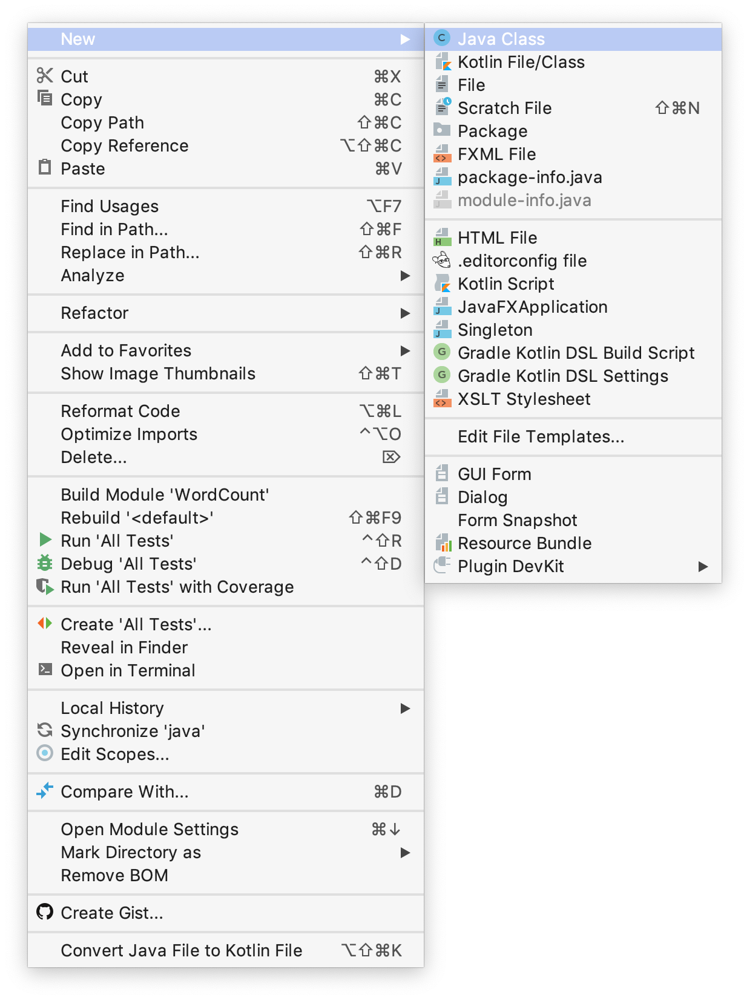

Paste the Java code into **WordCount.java** (this is from the original Hadoop [MapReduce Tutorial](https://hadoop.apache.org/docs/current/hadoop-mapreduce-client/hadoop-mapreduce-client-core/MapReduceTutorial.html)).
```java
import java.io.IOException;
import java.util.StringTokenizer;

import org.apache.hadoop.conf.Configuration;
import org.apache.hadoop.fs.Path;
import org.apache.hadoop.io.IntWritable;
import org.apache.hadoop.io.Text;
import org.apache.hadoop.mapreduce.Job;
import org.apache.hadoop.mapreduce.Mapper;
import org.apache.hadoop.mapreduce.Reducer;
import org.apache.hadoop.mapreduce.lib.input.FileInputFormat;
import org.apache.hadoop.mapreduce.lib.output.FileOutputFormat;

public class WordCount {

    public static class TokenizerMapper
            extends Mapper<Object, Text, Text, IntWritable> {

        private final static IntWritable one = new IntWritable(1);
        private final Text word = new Text();

        public void map(Object key, Text value, Context context
        ) throws IOException, InterruptedException {
            StringTokenizer itr = new StringTokenizer(value.toString());
            while (itr.hasMoreTokens()) {
                word.set(itr.nextToken());
                context.write(word, one);
            }
        }
    }

    public static class IntSumReducer
            extends Reducer<Text, IntWritable, Text, IntWritable> {
        private IntWritable result = new IntWritable();

        public void reduce(Text key, Iterable<IntWritable> values,
                           Context context
        ) throws IOException, InterruptedException {
            int sum = 0;
            for (IntWritable val : values) {
                sum += val.get();
            }
            result.set(sum);
            context.write(key, result);
        }
    }

    public static void main(String[] args) throws Exception {
        Configuration conf = new Configuration();
        Job job = Job.getInstance(conf, "word count");
        job.setJarByClass(WordCount.class);
        job.setMapperClass(TokenizerMapper.class);
        job.setCombinerClass(IntSumReducer.class);
        job.setReducerClass(IntSumReducer.class);
        job.setOutputKeyClass(Text.class);
        job.setOutputValueClass(IntWritable.class);
        FileInputFormat.addInputPath(job, new Path(args[0]));
        FileOutputFormat.setOutputPath(job, new Path(args[1]));
        System.exit(job.waitForCompletion(true) ? 0 : 1);
    }
}
```
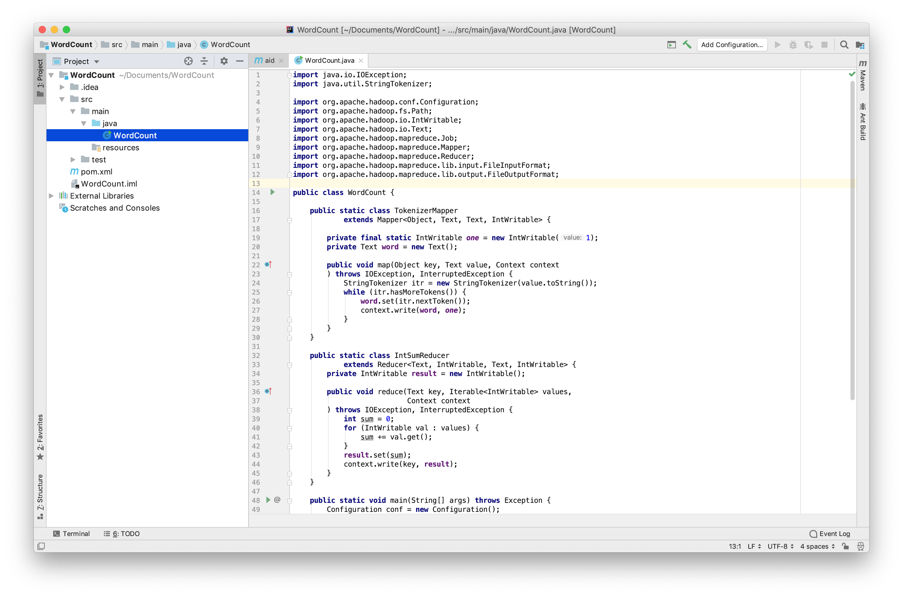

### Prepare to run
The same **WordCount** program scans all text files in the folder defined by the first argument, and outout the frequencies of all words into a folder defined by the second argument.

Create a folder named **input** under  the project's root folder (same as **src**), put some text files inside it.
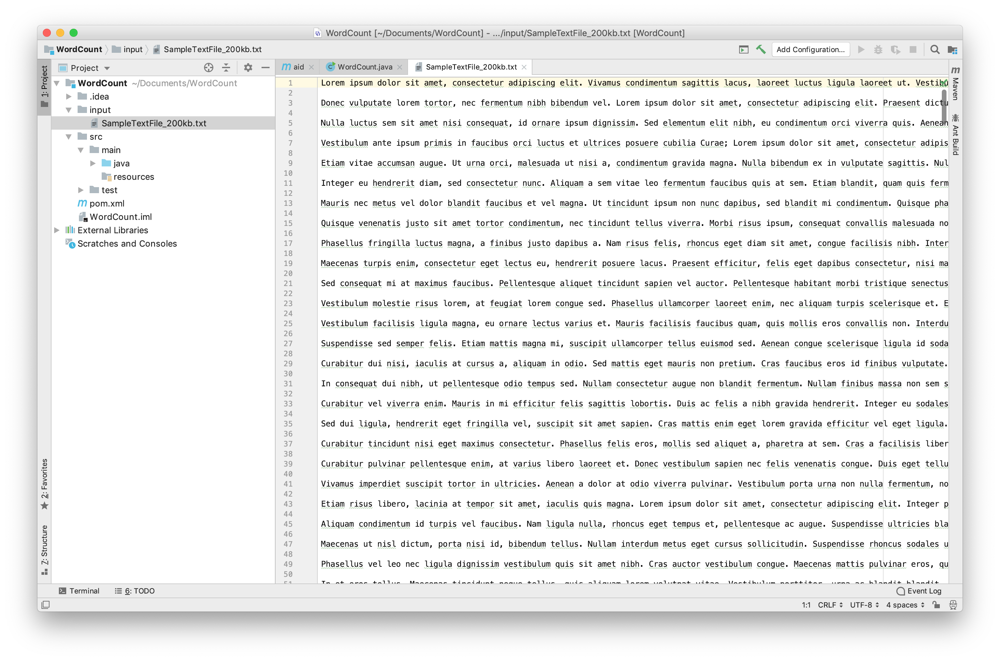

Then set the 2 program arguments. Select `Run`&rarr;`Edit Configurations`.
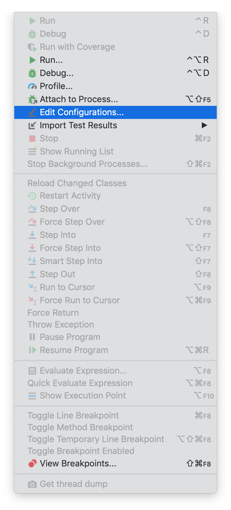

Add a new `Application` configuration, set the `Name` be **WordCount**, set the `Main class` be **WordCount**, set `Program arguments` be **input output**. This allows the program to read from **input** folder and save the result to **output** folder. Do not create the output folder, as Hadoop will create the folder automatically. If the folder exists, Hadoop will raise exceptions.
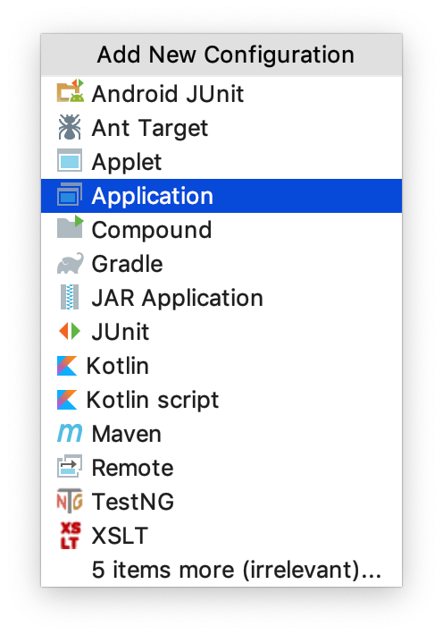
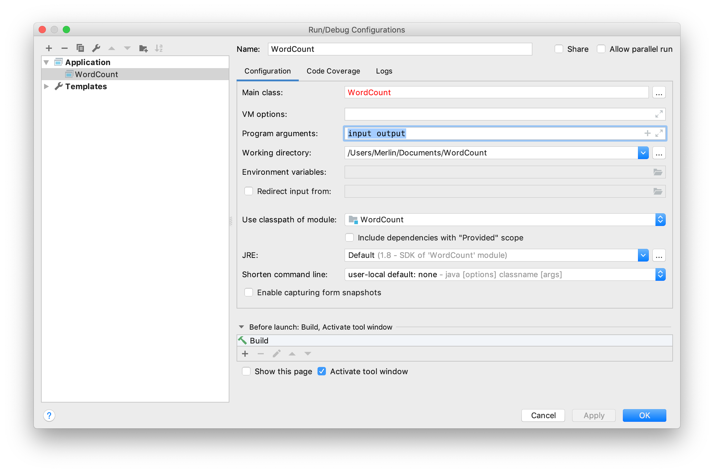


### Run
Select `Run`&rarr;`Run 'WordCount'` to run the Hadoop program. If you re-run the program, delete the **output** folder before each run.
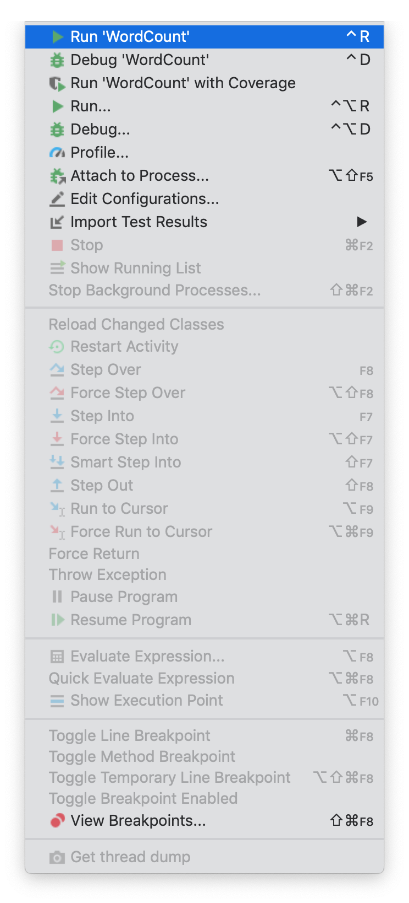

Results are saved in **output/part-r-00000**.
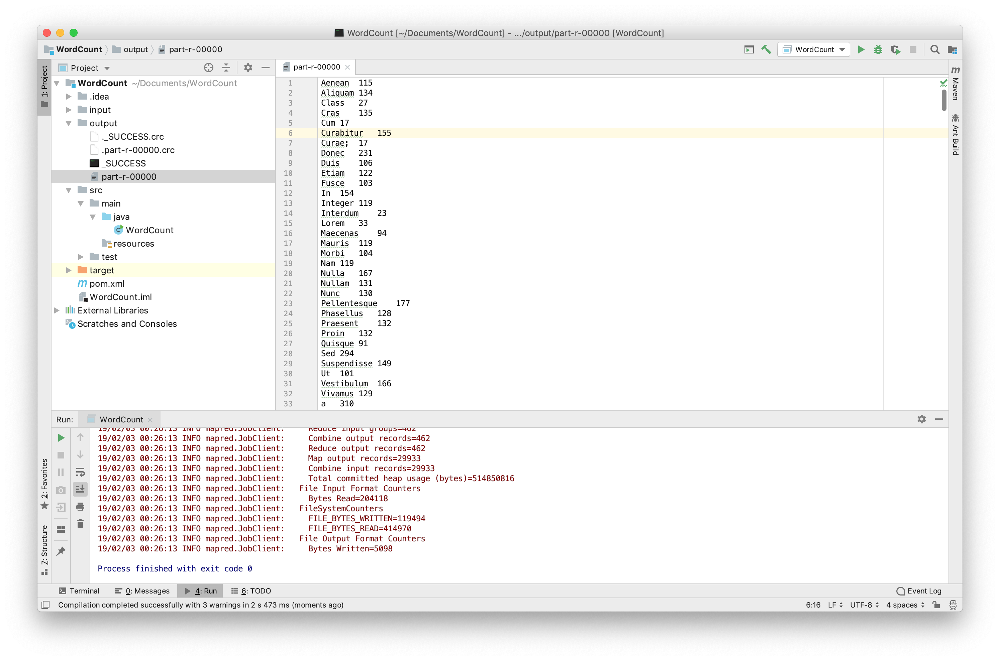


## Build Runnable JAR with Dependencies
You can build a single jar file with your program and all necessary dependencies (e.g, Hadoop libraries) so you can transfer the jar file to another machine to run it.

Add the following block to **pom.xml**. `build` block should be at the same level of `repositories` block and `dependencies` block.
```xml
<build>
    <plugins>
        <plugin>
            <groupId>org.apache.maven.plugins</groupId>
            <artifactId>maven-compiler-plugin</artifactId>
            <configuration>
                <source>8</source>
                <target>8</target>
            </configuration>
        </plugin>
        <plugin>
            <artifactId>maven-assembly-plugin</artifactId>
            <executions>
                <execution>
                    <phase>package</phase>
                    <goals>
                        <goal>single</goal>
                    </goals>
                </execution>
            </executions>
            <configuration>
                <archive>
                    <manifest>
                        <!-- Path to your main class, include package path if needed -->
                        <mainClass>WordCount</mainClass>
                    </manifest>
                </archive>
                <descriptorRefs>
                    <descriptorRef>jar-with-dependencies</descriptorRef>
                </descriptorRefs>
            </configuration>
        </plugin>
    </plugins>
</build>
```

Then in a terminal, `cd` to the folder which contains the **pom.xml** file, execute the following command:
```bash
mvn package
```
This will build **wordcount-1.0-SNAPSHOT-jar-with-dependencies.jar** under **target** folder. To run your program, execute the following command:
```bash
java -jar target/wordcount-1.0-SNAPSHOT-jar-with-dependencies.jar input output
```

## Issues on Windows
You may encounter errors when running the Hadoop program on Windows:
```
ERROR security.UserGroupInformation: PriviledgedActionException as ...
```
This is because the Hadoop library tries to access some Unix specific path (e.g. /tmp), and tries to run some Unix specific functions (e.g. set folder permission to 0700). There are some possible solutions, for example, overriding Hadoop's configuration to set the correct temporary folder, or applying patches to Hadoop library to bypass Unix specific functions. However, it is still highly recommended to run Hadoop program on Linux or Mac OS.

## Sample Project
See [WordCount](WordCount/).

